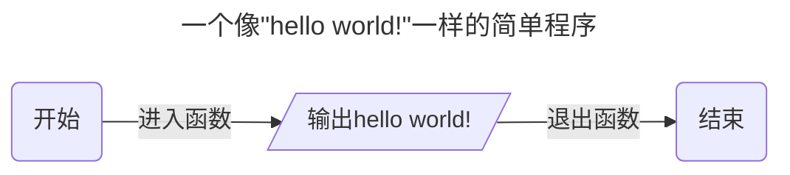
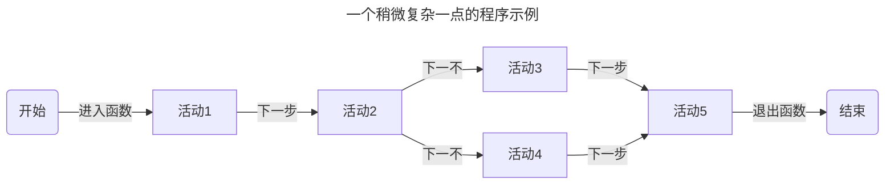
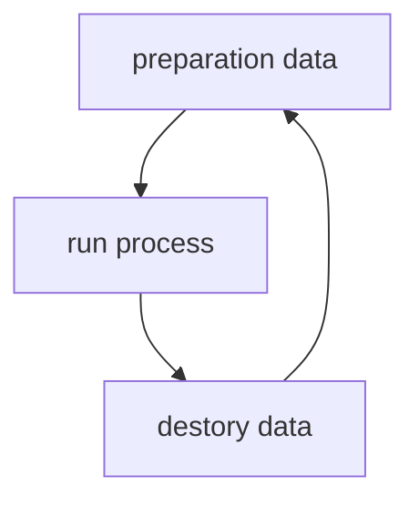
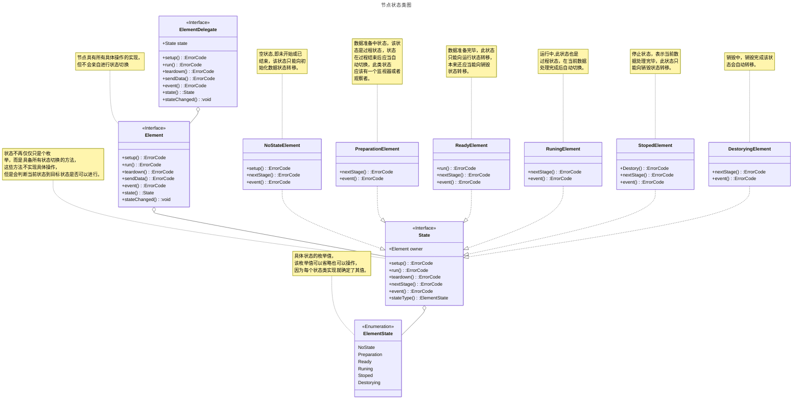

# LLWorkFlows
一次对流计算框架的尝试 

## 为什么要做这个
简化程序或项目的构建一直是一个挑战，许多大佬已经使用他们的框架来提供各种答案。例如： 

著名的UI框架，如 Qt、Flutter、Node.Js 等。还有广泛使用的Chromium核心，它们都具有不错的性能和无与伦比的便利性。
著名的游戏框架，如Godot Engine、Unreal Engine、unity engine等，比简单的UI框架有更好的性能和更强的动画支持，但它们也更大。而且学习成本更高。
但是现在，我只需要一个用C++开发的流处理框架来使用越来越强大的CPU和GPU，而无需细致的分析和考虑不同线程的同步。

## 我想要实现什么
我想要实现一个流计算框架，它应当具备如下的特点：
- 函数式可自定义节点。
- 可自行同步的安全的数据传递。
- 细致的状态转移与控制。
- 完备的调试接口。
- 充分的利用现有资源进行并行计算。
- 完全插件化的功能管理。
- 面向接口编程，更少的实现。

基于以上特点，这可能更偏向一种编程指导，通过提供接口与运行流程的约束规范程序的结构。使其更容易优化与测试。
## 一个程序应该如何运行

可以让这个程序更加的复杂一点。

是不是觉得还是少了什么，这里没有条件结构和循环结构呢，为什么没有呢，因为这两个结构会极大的增加图本身的复杂性。如何保证只有顺序结构的图能够安全效率的运行本身就已经足够复杂了。当然，你可以自行扩展对其他结构的支持。

接下来是对以上结构的细化讨论了。首先需要明确的是，我们期望所有的活动或者说流程中的每一步都是一个节点，即特点中的函数式节点。在这里节点可能需要一下的行为：

- 能够被方便的调试。
- 拥有独立的状态且能够安全的在各个状态之间转移。
- 能够接收来自上一步的数据。
- 能够提供数据给下一步执行。
- 能够取得自身关注的来自系统和其他节点的属性。
- 能够暴露自己的属性供系统（调度or调试）和其他节点使用。
- 尽可能少的依赖与状态。

尽管很想细致的约束节点的定义，以方便调度，调试，修饰，等等来给节点附加检测，附加功能，或者方便管理，控制。但显然我无法预期它将会被用于实现什么，以及实现这个功能该节点需要同其他哪些对象交互，但不管怎样，在这里将对其进行如下的拆分，一个功能的实现只有两个部分，数据和逻辑。数据无论什么时候都是服务逻辑的。因此我将直观的将其划分为如下3个必要的阶段

如上的3个阶段的循环6种可能状态的切换是否就能够应对所有的情况我们无从得知，且过于复杂的设计会违背最开始的初衷，因此这里就该模型进行分析，结合我们使用的语言，c++有着非常繁琐的对象管理操作，我们发现，preparation data阶段和c++类的构造函数，destory data与析构函数非常的相似，那么是不是在这里就可以省略掉这两个步骤了呢，最终基于以下的理由我放弃将他们合并的想法了：
- 我需要的数据可能是运行时产生的，以及显然我不希望现在还没有被用到的节点过早的将他需要的数据缓存到内存中来。
- 数据的销毁也是如此，我不希望节点在结束自己的任务后还持有着无用的数据直到图全部执行完被释放。
- 我可能需要点时间来准备这些数据，但我不希望这件事影响图的创建。
- 图可能运行不起来或者有着不合理的设计，如果这样我希望在数据进来之前尽快都通知用户。
- 没有什么比完全可知可控的行为更让人放心的事了。

如此我们得到了如下的状态
- NoState (在初始化数据之前，销毁数据之后的状态，这是一个标记状态)
- Preparation (准备数据可能是一个漫长的过程，这不仅需要创建你需要的属性，还可能需要等待上一个节点生产必要的数据。这是一个过程状态)
- Ready (一切都已经准备就绪了，这是一个标记状态)
- Running (这里将执行最重要的逻辑部分，同时也是我们希望通过这个框架优化的核心部分，这是一个过程状态)
- Stoped (计算执行完毕，这是一个标记状态)
- Destorying (将生成的数据送出，然后把你不在需要的数据销毁掉。也许你会在执行逻辑的过程中自行销毁掉不再需要的数据，但如果你对它的时机不太好把握时可以将他们转移到这里，我们将会保证，每一次执行都会完整的按照上面的循环重复。这是一个过程状态)

我给上面的状态进行了分类，我想这个分类应该还算直观，所有的标记状态都是暂停状态，意味着你的准备工作已经完成了，随时可以进入下一个阶段，也可以就此停止。
接下来就是如何进入每一个阶段。首先需要明确的是：
- 过程状态需要由框架控制进入的时机，因此他们需要明确的入口函数，那么可以确认的节点接口
    - setup (开始准备数据的入口)
    - run (开始处理数据的入口)
    - teardown (释放不再需要的数据的入口)
- 尽管设置了入口，但事情并不总是会尽人意，你可能无法在setup中得到所有预期的数据，因为来自上一个节点的数据并不总是那么的快的给出。
    - 也许我们还需要一个接口用来随时接收来自意料之外的时机给到的数据。但显然我无法预知所有可能的数据并为他们一一设置接口，因此我需要一个用于处理事件的接口，如event,它可能收到来自上一个节点发送的数据，也可能收到来自管理者的发出的指令,但可以预见的问题是过快的生产者和过慢的生产者的搭配会让事件不断的积压。因此这里不得不对来自上一个节点的数据流做特别的处理。
    - sendData (这里直接将数据发送给节点，并要求它立刻对该数据进行紧急处理，缓存、拒绝或者丢弃。)
    - event (这里处理来自系统，用户，或其他节点的事件，也许不会也不应该将这个接口暴露给其他节点，因为到这里意味着节点必须马上处理该事件，系统应该选择在节点不那么繁忙的时候也就是标记状态下将需要节点处理的事件交给节点。)

尽管当下只有3个阶段6个状态。但无法保证之后不会有更多的状态和阶段需要加入，现在考虑未发生的事情并不是明智但还是得做出选择，是直接通过入口让节点进入对应的状态，还是调用nextStage让节点自己决定自己的下一个阶段。如果考虑最终版本我认为可以让节点自己决定下一个阶段是什么，同是每个阶段是否可以中断通过属性查询。
如此得到了大概的设计样式如下
