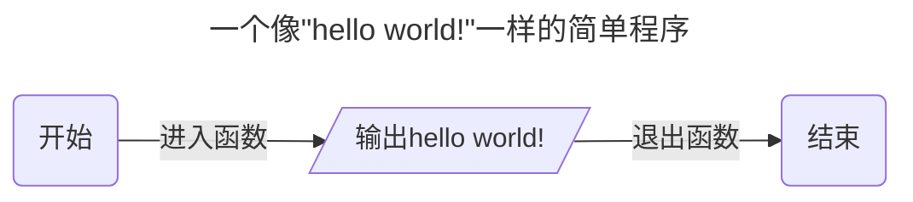
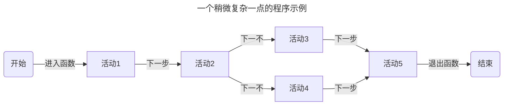

# LLWorkFlows
一次对流计算框架的尝试 

## 为什么要做这个
简化程序或项目的构建一直是一个挑战，许多大佬已经使用他们的框架来提供各种答案。例如： 

著名的UI框架，如 Qt、Flutter、Node.Js 等。还有广泛使用的Chromium核心，它们都具有不错的性能和无与伦比的便利性。
著名的游戏框架，如Godot Engine、Unreal Engine、unity engine等，比简单的UI框架有更好的性能和更强的动画支持，但它们也更大。而且学习成本更高。
但是现在，我只需要一个用C++开发的流处理框架来使用越来越强大的CPU和GPU，而无需细致的分析和考虑不同线程的同步。

## 我想要实现什么
我想要实现一个流计算框架，它应当具备如下的特点：
- 函数式可自定义节点。
- 可自行同步的安全的数据传递。
- 细致的状态转移与控制。
- 完备的调试接口。
- 充分的利用现有资源进行并行计算。
- 完全插件化的功能管理。
- 面向接口编程，更少的实现。

基于以上特点，这可能更偏向一种编程指导，通过提供接口与运行流程的约束规范程序的结构。使其更容易优化与测试。
## 一个程序应该如何运行

可以让这个程序更加的复杂一点。

是不是觉得还是少了什么，这里没有条件结构和循环结构呢，为什么没有呢，因为这两个结构会极大的增加图本身的复杂性。如何保证只有顺序结构的图能够安全效率的运行本身就已经足够复杂了。当然，如果你可以自行扩展对其他结构的支持。

接下来是对以上结构的细化讨论了。首先需要明确的是，我们期望所有的活动或者说流程中的每一步都是一个节点，即特点中的函数式节点。在这里节点可能需要一下的行为：

- 能够被方便的调试。
- 拥有独立的状态且能够安全的在各个状态之间转移。
- 能够接收来自上一步的数据。
- 能够提供数据给下一步执行。
- 能够取得想要的值。
